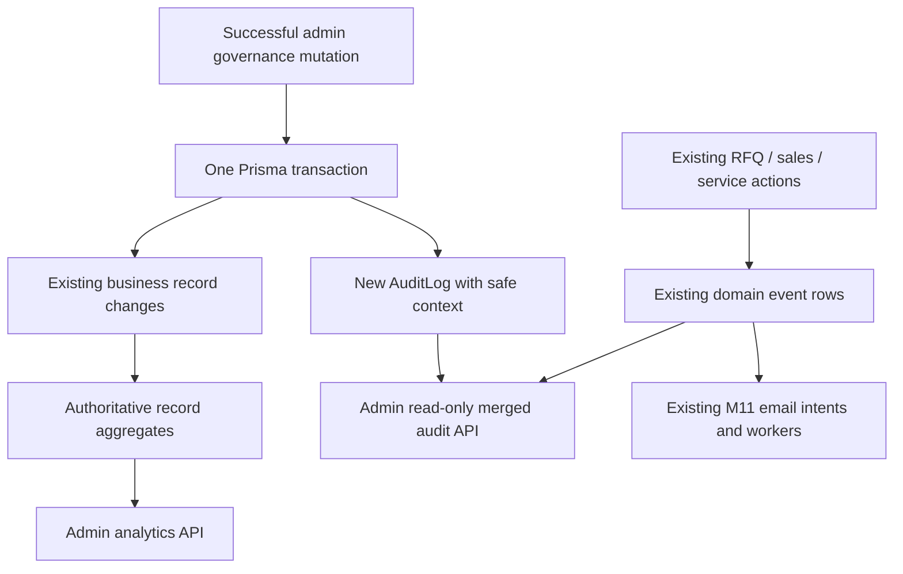

# Milestone 12 — Analytics & Audit

## Scope and source of truth

The master specification names M12 but does not define particular metrics, audit actions or audiences. The supplied brief requires inspection, separation of reporting from audit, privacy, authorization and regression validation. The user approved the inspected implementation plan: admin-only operational counts/creation activity, a merged read-only event viewer, and transactional governance audit. M0–M11 business rules remain in force; M13 is not implemented.

## Analytics

`GET /api/v1/admin/analytics/overview` returns a repeatable-read snapshot (`asOf`) and bounded daily creation counts. Both APIs require an active, verified ADMIN and a live unrevoked session through existing authentication. Non-admin dashboard layouts deny access as well; hiding navigation is not the security boundary.

| Current/all-time metric | Grouping |
| --- | --- |
| User accounts | Account status |
| Role assignments | Role; a multi-role user contributes multiple assignments |
| Machinery records | Stored DRAFT/PUBLISHED status; not inferred public visibility |
| Supplier profiles | Approval/status, and a separate type breakdown |
| Current subscription terms | Effective ACTIVE/EXPIRED/SUSPENDED/CANCELLED/PENDING state |
| RFQs | Current status |
| Sales opportunities | Current stage |
| Sale records | Current status; no revenue/financial inference |
| Reviews | Moderation status |
| Service tickets | Current status, and a separate warranty-assessment breakdown |
| RFQ/service email intents | Separate durable delivery-status breakdowns |

Subscription reporting considers only `isCurrent` terms and matches existing entitlement precedence: CANCELLED/SUSPENDED first, then expired end date, then explicit PENDING/future start, otherwise ACTIVE. It does not write automatic expiration events. Snapshot totals include inactive users, non-public machinery and pending suppliers. They are stored operational counts, not unique marketplace visitors, conversions or public catalogue counts.

Email SENT means accepted by the provider, not verified inbox receipt. Auth emails have no durable delivery model and are excluded. No credentials, provider message IDs, recipient addresses or failure details are reported.

Daily activity counts creation timestamps for users, machinery, suppliers, RFQs, sale records, reviews and service tickets. Optional paired `from`/`to` use real YYYY-MM-DD calendar dates, inclusive Asia/Dhaka days; default last 30 days including today, maximum 90. Boundaries convert to UTC `[start, next-day-end)` and grouping uses Asia/Dhaka. Missing days return zeros. Date controls affect creation activity only; all-time snapshot totals remain current. No historical status reconstruction, deleted-record reconstruction or inferred funnel rates is claimed.

## Audit architecture



Analytics reads authoritative records; it does not depend on new governance logs or introduce an event bus. The viewer uses SQL UNION ALL to project each existing `RfqEvent`, `SalesEvent`, `ServiceTicketEvent` exactly once alongside AuditLog. No duplicate domain events, page-view events, IP addresses, user agents or invasive tracking are added.

New successful **admin** governance actions:

| Resource | Actions |
| --- | --- |
| USER | USER_ACCESS_UPDATED |
| CATEGORY | CATEGORY_CREATED / CATEGORY_UPDATED / CATEGORY_DELETED |
| MACHINERY | MACHINERY_CREATED / MACHINERY_UPDATED / MACHINERY_DELETED |
| SUPPLIER | SUPPLIER_ADMIN_UPDATED (review/status and admin profile saves) |
| SUBSCRIPTION_PLAN | SUBSCRIPTION_PLAN_CREATED / SUBSCRIPTION_PLAN_UPDATED |
| SUBSCRIPTION | SUBSCRIPTION_ASSIGNED / SUBSCRIPTION_UPDATED |
| REVIEW | REVIEW_MODERATED |

Each record retains actor ID, action, resource type/ID and timestamp. Context stores changed field **names** and allowlisted enum states, roles, flags and subscription dates. Values of notes, descriptions, contacts, registration/documents, RFQ/messages, quote/sale pricing, passwords and tokens are excluded. The reader reprojects even stored context defensively. Existing domain metadata/service notes are not selected at all; safe service before/after status is retained. Actor display name/ID is the only joined account projection, and names reflect current account names. Null historic domain actors appear as “System / unavailable”, not a guaranteed automated identity.

New governance audit insertion and its mutation share the same transaction. An audit database failure rolls back the business change. Unauthorized, failed or stale mutations do not create misleading successful governance records. Supplier-owned catalogue/profile changes and ordinary buyer review/profile changes are not newly audited by M12. Existing RFQ/sales/service history remains unchanged.

AuditLog has a required actor foreign key (RESTRICT deletion), polymorphic resource ID (preserves deleted catalogue references), typed resource enum, safe JSON context and indexes for date/ID, actor/date, resource/date and action/date. Existing event models gain global date/ID indexes. Migration `20261005140000_analytics_audit` is additive and creates no fabricated historical governance rows. Application code exposes no audit update/delete/create/export endpoints. This is application append-only history, not a claim of tamper-proof storage against a database administrator. Existing domain retention/deletion rules remain unchanged; no new retention purge is added.

## Audit API and limits

`GET /api/v1/admin/audit-logs` supports optional paired `from`/`to` (default last 30 days, maximum 366 Asia/Dhaka calendar days), `source` (ADMIN/RFQ/SALES/SERVICE), `actorId` (UUID), `action` (uppercase action code), `resourceType`, `resourceId` (UUID), `page` (1–10000), `limit` (1–50; default20). Unknown/invalid query fields are rejected. Results contain `entries`, `pagination`, `range`; entry IDs are source-prefixed. Newest-first pagination orders by timestamp, source, ID for stable ties within a read. Counts and rows share a repeatable-read snapshot. New events between requests can naturally shift offset pages; this is not a frozen export.

Queries use database count/groupBy/SQL aggregation and limited audit rows instead of loading records into application memory. A transaction timeout bounds work. No new cache, chart dependency, provider, worker, denormalized metric model or email integration is needed. Production indexing/query tuning belongs to later measured work rather than M12 assumptions.

## Frontend

Admin sidebar links lead to `/dashboard/admin/analytics` and `/dashboard/admin/audit-logs`. AnalyticsWorkspace reuses PageHeader, Button, LoadingState, EmptyState, existing surface/control styles and typed apiClient/session conventions. Current count cards and an accessible horizontally scrollable daily table replace chart dependencies. Audit uses responsive event cards, labelled filters, safe expandable state context and pagination. Abortable requests handle obsolete filter changes; loading, empty, invalid filter, transport failure and retry states are provided. Server layouts enforce current role access.

Created client files: `types/analytics.ts`, `lib/api/analytics.service.ts`, `components/shared/AnalyticsWorkspace.tsx`, and page/layout pairs under existing admin analytics/audit-logs routes. DashboardShell is extended in place. Backend modules are `modules/analytics` and `modules/audit`, with controller/routes/validation/services; existing governance controllers pass the authenticated actor into transactional services.

## Deployment

Use matching `milestone-12` repositories. No new environment variable, dependency or provider is required.

```sh
# imet-server
npm run db:validate
npm run db:generate
npm run db:deploy
npm run build
npm run typecheck
npm run lint
npm test
# imet-client
npm run type-check
npm run lint
npm run build
```

Restart the API/frontend after their builds; keep existing RFQ maintenance/email workers on the matching backend version. Apply all 14 migrations without resetting data. Existing Resend/Bunny/OpenAI settings stay backend-only. Resend key/sender were absent in this environment, so real email delivery remains unverified; M11 provider/queue mocks and maintenance dispatch are tested independently.

## Validation

Both repos pass strict TypeScript, ESLint and production builds; Prisma validate/generate/deploy/status report all14 migrations applied with no schema drift. **92 backend tests pass, zero failed/skipped**, including M12 calendar/date and query validation, safe projection, real API admin/session/role gates, every new governance action, actor/resource tracking, private-value exclusion, stale/missing actor rejection, an actual scoped audit INSERT database failure that rolls back category creation, merged domain history without duplicate copies, null historic actors, timestamp ties/pagination/filters/empty activity, exact database totals, multi-role assignment counts, Dhaka midnight half-open boundaries, every effective current-term precedence and larger bounded pages. A rolled-back private-schema upgrade test preserves M11 domain records/notification intents and checks new indexes/foreign keys. Existing M0–M11 suites pass.

Production Playwright checks at390/820/1440px cover real admin sign-in, date filters, audit pagination/source/actor/resource/action filtering, safe state expansion, private payload exclusion, empty/invalid filters, controlled transport error/retry, buyer denial, and no document overflow/runtime errors. Matching service-ticket lifecycle and maintenance-dispatch regressions are checked with scoped fixtures. Fixtures/queues are cleaned after validation.

Remaining limits: no live email inbox/deliverability verification without existing Resend configuration; no production-scale latency benchmark, immutable DB-admin audit guarantee, retrospective status history, export or retention policy. M13 remains unimplemented.
